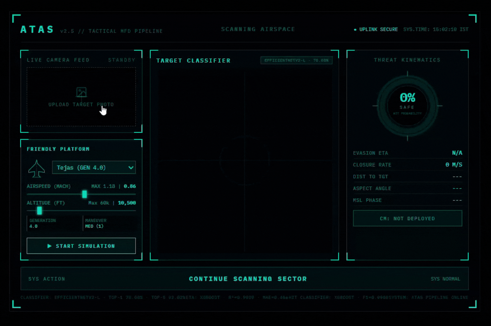
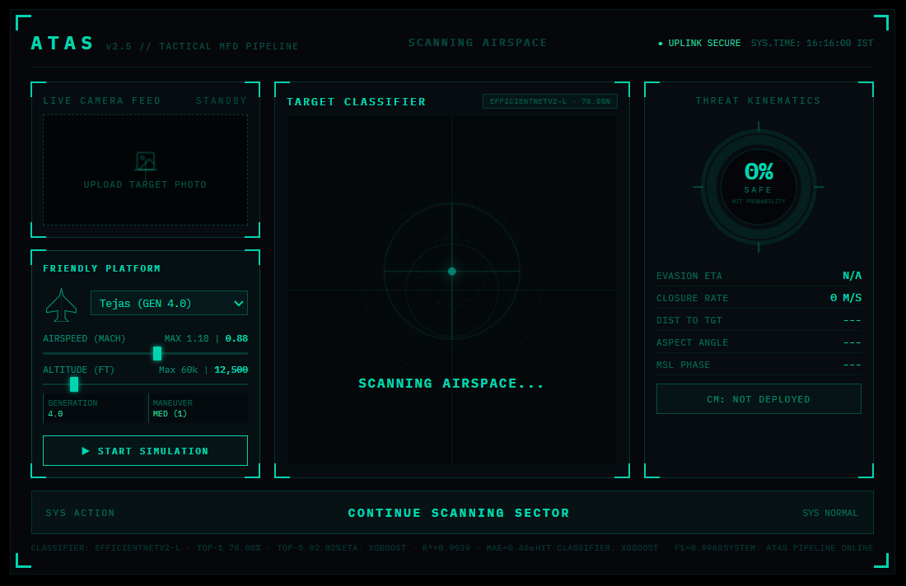
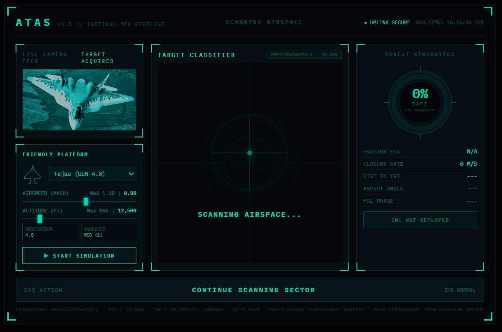
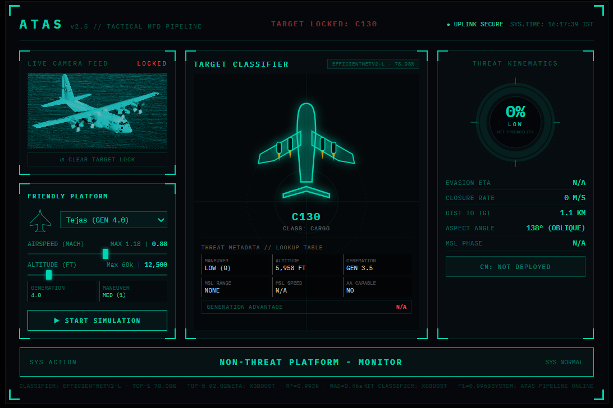
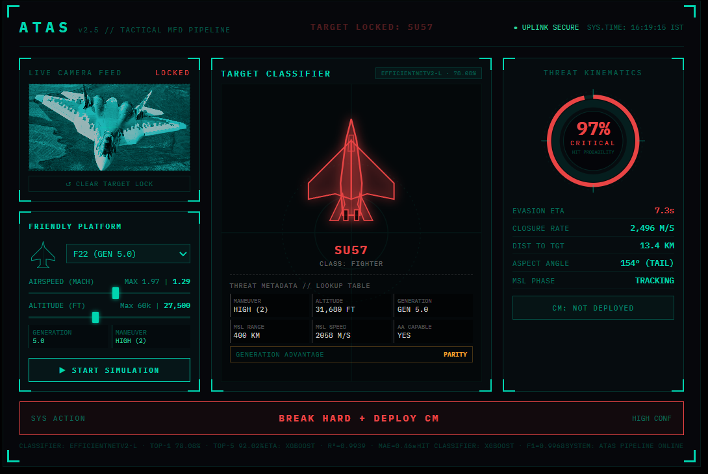

# ATAS

## Aerial Threat Assessment System



ATAS is an end to end ML threat assessment pipeline that identifies aircraft from images, simulates engagement scenarios, predicts evasion survivability, and generates cockpit style tactical recommendations.

[Live Demo on Hugging Face Spaces](https://huggingface.co/spaces/Eakempreet/ATAS)

---

## Pipeline overview

```text id="u3x4bq"
       Aircraft Image
              ↓
       [1] EfficientNetV2 L Aircraft Classifier
              ↓
       [2] Aircraft Metadata Lookup
              ↓
       [3] Physics Based Scenario Generation
              ↓
 ┌───────────────────────────────────────┐
 ↓                                       ↓
[4] ETA Regressor                      [5] Hit Classifier
 ↓                       ↓
 └────────── Threat Assessment ──────────┘
                    ↓
        [6] Tactical Decision Layer
                    ↓
        [7] FastAPI Backend + HUD
```

---

## Why this exists

ATAS was inspired by fighter jet Radar Warning Receiver systems where pilots need fast threat interpretation under incomplete information.

The project explores what happens when computer vision, physics simulation, structured ML, and tactical logic are connected into one inference pipeline.

It is not a real military system and does not attempt to simulate classified avionics behavior. The goal was building a complete end to end ML system where an aircraft image becomes a tactical recommendation through multiple independent subsystems working together.

---

## Inspiration

One of the biggest inspirations behind ATAS was the F-35 Distributed Aperture System (DAS).

DAS is a real world sensor fusion system that combines infrared cameras around the aircraft to give the pilot full spherical threat awareness and automatic warning cues directly inside the cockpit.

ATAS is obviously not attempting to recreate that system. The scale and complexity are completely different.

What fascinated me was the idea of multiple independent subsystems working together to help a pilot interpret a threat quickly under pressure. That became the core design idea behind this project.

---

## Screenshots

<table>
  <tr>
    <td align="center">
      
      <br/>
      Idle state
    </td>
    <td align="center">
      
      <br/>
      Target acquired
    </td>
  </tr>
  <tr>
    <td align="center">
      
      <br/>
      Safe state (C 130, green)
    </td>
    <td align="center">
      
      <br/>
      Critical threat (Su 57 vs F 22, red)
    </td>
  </tr>
</table>

---


## Tech stack

| Category              | Technology                   |
| --------------------- | ---------------------------- |
| Deep Learning         | TensorFlow, EfficientNetV2 L |
| Structured ML         | XGBoost, scikit learn        |
| Hyperparameter Tuning | Optuna                       |
| Backend               | FastAPI, uvicorn             |
| Frontend              | HTML, CSS, JavaScript        |
| Containerization      | Docker                       |
| Deployment            | Hugging Face Spaces          |
| Data Processing       | pandas, numpy                |
| Version Control       | Git, GitHub, Git LFS         |

---

## Model metrics

| Model               | Algorithm          | Key Metric     | Score          |
| ------------------- | ------------------ | -------------- | -------------- |
| Aircraft Classifier | EfficientNetV2 L   | Top 1 Accuracy | 78.08%         |
| Aircraft Classifier | EfficientNetV2 L   | Top 5 Accuracy | 92.02%         |
| ETA Regressor       | XGBoost Regressor  | R²             | 0.9939         |
| ETA Regressor       | XGBoost Regressor  | MAE            | 0.4552 seconds |
| Hit Classifier      | XGBoost Classifier | Recall         | 0.9966         |
| Hit Classifier      | XGBoost Classifier | ROC AUC        | 0.9999         |

---

## Key design decisions

### Why ML exists alongside physics

Physics equations require complete and clean inputs. Real inference environments rarely provide that.

The physics generator creates structured ground truth engagement data. The ML models learn the non linear patterns from those scenarios and later generalize from partial inputs during inference.

---

### Why two models instead of one

The ETA regressor predicts when the pilot needs to react.

The hit classifier predicts whether evasion is likely to succeed.

Neither answer is useful alone. Together they answer the actual cockpit question:

> Do I have enough time and will evasion work?

---

### Why XGBoost

XGBoost consistently produced the best MAE across all tested regressors.

It also provided:

* GPU accelerated Optuna tuning
* Large hyperparameter search space
* Stable inference behavior
* SHAP explainability support

The final Optuna search ran for approximately 944 trials.

---

### Why the decision layer is rule based

The tactical recommendation layer is intentionally deterministic in V1.

This keeps the system:

* Explainable
* Easy to debug
* Easy to validate
* Fast to iterate on

A natural V2 upgrade would be replacing this layer with a reinforcement learning policy agent.

---

### Why the `.keras` model lives on Hugging Face

The final EfficientNetV2 L classifier model is approximately 898MB.

That exceeds practical GitHub LFS usage limits, so the production weights are hosted separately on Hugging Face instead.

This became a real deployment constraint during the project rather than a theoretical architecture choice.

---

## Repository structure

```text id="k37t0g"
ATAS_Project/
├── app/
│   ├── main.py
│   ├── test_pipeline.py
│   └── README.md
│
├── src/
│   ├── classifier.py
│   ├── metadata.py
│   ├── physics_generator.py
│   ├── models.py
│   ├── decision.py
│   ├── schemas.py
│   ├── analysis_for_physics_generator.ipynb
│   └── README.md
│
├── notebooks/
│   ├── 01_aircraft_classifier_v1.ipynb
│   ├── 02_aircraft_classifier_v2.ipynb
│   ├── 02_eta_regressor.ipynb
│   ├── 03_hit_classifier.ipynb
│   └── README.md
│
├── frontend/
│   └── atas_hud_v11.html
│
├── release_models/
│   ├── aircraft_classifier/
│   ├── eta/
│   └── hit/
│
├── assets/
│   └── demonstration/
│
├── data/
│   └── aircraft_metadata.csv
│
├── Dockerfile
├── requirements.txt
└── README.md
```

---

## How to run locally

### Docker

```bash id="cz6f7x"
git clone https://github.com/Eakempreet/ATAS_Project.git
```

```bash id="gf9f0j"
cd ATAS_Project
```

```bash id="zj7x2m"
docker build -t atas .
```

```bash id="x6sz7v"
docker run -p 7860:7860 atas
```

Open:

```text id="qu50nf"
http://localhost:7860
```

---

### Manual uvicorn

```bash id="oz9o8w"
pip install -r requirements.txt
```

```bash id="xxjv9f"
uvicorn app.main:app --host 0.0.0.0 --port 8000
```

Open:

```text id="s0n40o"
http://localhost:8000
```

---

## Dataset and model weights

| Resource             | Link                                                                     |
| -------------------- | ------------------------------------------------------------------------ |
| Dataset              | https://kaggle.com/datasets/a2015003713/militaryaircraftdetectiondataset |
| Live Demo            | https://huggingface.co/spaces/Eakempreet/ATAS                            |
| Model Weights Backup | https://huggingface.co/Eakempreet/ATAS-models                            |
| GitHub Repository    | https://github.com/Eakempreet/ATAS_Project                               |

---

## Sub README navigation

| Folder       | README                | What it covers                           |
| ------------ | --------------------- | ---------------------------------------- |
| `notebooks/` | `notebooks/README.md` | Model training pipelines and experiments |
| `src/`       | `src/README.md`       | Core inference modules and data flow     |
| `app/`       | `app/README.md`       | FastAPI backend and API endpoints        |
